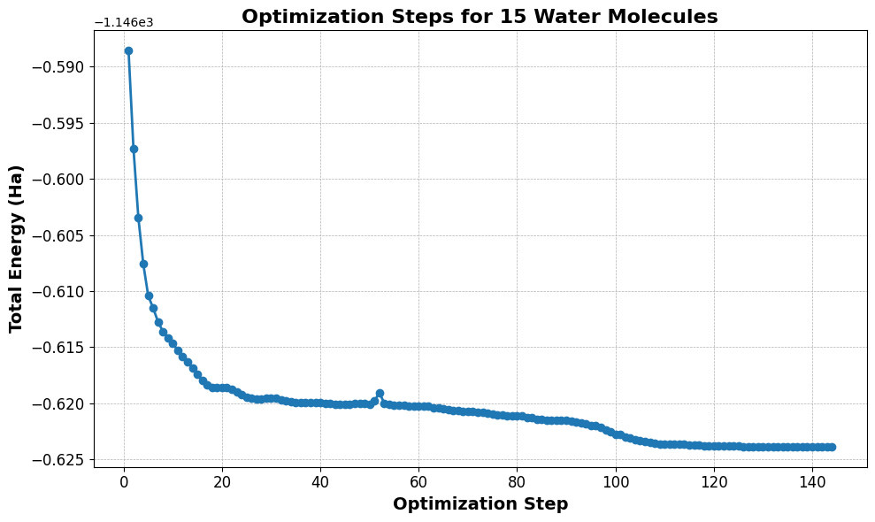
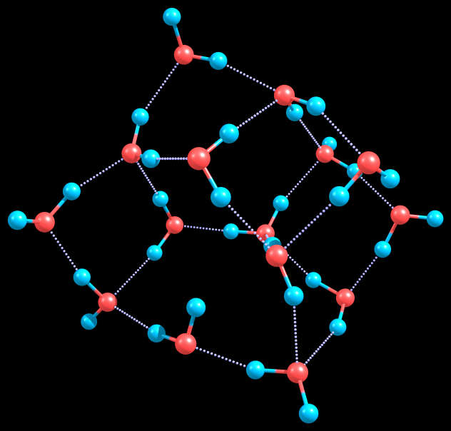

# Water Cluster (H₂O)₁₅: Geometry Optimization and Frequency Analysis

This folder contains DFT calculations of a 15-water molecule cluster using ORCA 6.0.0. The study includes geometry optimization, vibrational frequency analysis, and visualization of the structural and energetic results.

---

## Files

| File                      | Description |
|---------------------------|-------------|
| `opt_15h2o.inp`           | Input file for geometry optimization |
| `opt_15h2o.out`           | Output file for geometry optimization |
| `freq_15h2o.inp`          | Input file for frequency calculation |
| `freq_15h2o.out`          | Output file from frequency analysis |
| `15h2o_final.xyz`         | Optimized structure (XYZ format) |
| `opt_energy_15h2o.png`    | Plot of total energy vs. optimization steps |
| `15h2o_cluster_optimized.jpg` | Image of final cluster structure with hydrogen bonding |

---

## Methodology

- **Software**: ORCA 6.0.0
- **Functional**: B3LYP with Grimme D4 dispersion correction
- **Basis Set**: def2-TZVP
- **SCF Criteria**: VeryTightSCF
- **Parallelization**: 8 cores, 9000 MB memory
- **Calculations**:
  - Geometry optimization
  - Harmonic vibrational frequency analysis
- **Environment**: Gas phase

---

## Results

### Energy Convergence

The following plot shows the total electronic energy throughout the optimization steps, confirming smooth convergence:

---

### Final Structure

The final optimized geometry forms an extensive hydrogen-bonding network typical of water clusters:

---

## Key Observations

- All vibrational frequencies are real, confirming a true local minimum (no saddle points).
- The final geometry is physically meaningful and chemically stable.
- Bond lengths and angles align well with experimental data for hydrogen-bonded water clusters.
- Suitable for further studies, including:
  - IR spectrum prediction
  - Thermodynamic property analysis
  - Solvation or dielectric environment modeling

---

Created by [Handson Gisubizo](https://github.com/handsongisubizo)  
Contact: hgisubi1@jhu.edu
