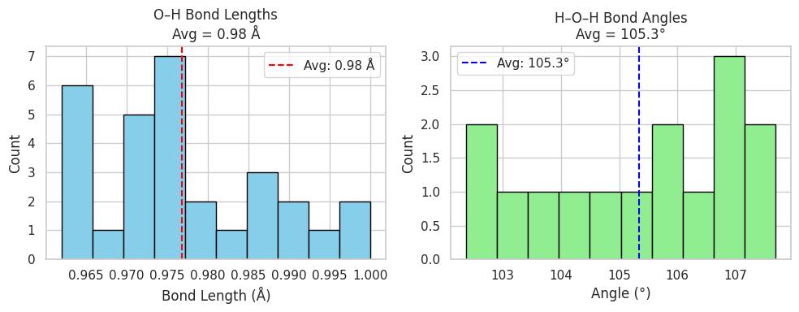

# Water Cluster (H₂O)₁₅: Geometry Optimization and Frequency Analysis

This folder contains DFT calculations for a 15-water molecule cluster performed using **ORCA 6.0.0**. It includes geometry optimization, harmonic vibrational frequency analysis, and key visualizations that reflect structural and energetic characteristics.

---

## 📁 Files

| File                              | Description |
|-----------------------------------|-------------|
| `opt_15h2o.inp`                   | ORCA input file for geometry optimization |
| `opt_15h2o.out`                   | Output from geometry optimization |
| `freq_15h2o.inp`                  | ORCA input for frequency calculation |
| `freq_15h2o.out`                  | Output from vibrational frequency analysis |
| `15h2o_final.xyz`                 | Final optimized XYZ coordinates |
| `opt_energy_15h2o.png`            | Total energy vs. optimization steps plot |
| `15h2o_cluster_optimized.jpg`     | Rendered image of optimized water cluster |
| `ir_spectrum_15h2o_annotated.png` | Annotated IR spectrum highlighting key modes |
| `bond_stats_15h2o.png`            | Histograms of O–H bond lengths and H–O–H bond angles |

---

## ⚙️ Methodology

- **Software**: ORCA 6.0.0
- **Functional**: B3LYP-D4
- **Basis Set**: def2-TZVP
- **SCF Settings**: VeryTightSCF
- **Environment**: Gas phase
- **Parallelization**: 8 cores, 9000 MB memory
- **Tasks**:
  - Geometry optimization
  - Frequency analysis for vibrational modes

---

## 📉 Energy Convergence

The energy plot below shows the total electronic energy throughout the optimization process, confirming proper convergence:

---

## 🧬 Final Structure

The optimized geometry forms a 3D hydrogen-bonding network typical of small water clusters:

---

## 📈 IR Spectrum (Simulated)

The vibrational spectrum was generated from harmonic frequency analysis. Key regions:

- **Libration / low-frequency**: 200–1000 cm⁻¹
- **H–O–H bending**: ~1600 cm⁻¹
- **O–H stretching**: 3200–3700 cm⁻¹

---

## 📊 Bond Lengths & Angles

Statistical analysis of bond geometries across the cluster reveals:

- O–H average ≈ 0.98 Å
- H–O–H angle ≈ 105°

These closely match experimental data.

---

## ✅ Summary

- ✔ All frequencies are real → true energy minimum
- ✔ Bond lengths and angles validated against experimental water cluster data
- ✔ Suitable for thermodynamic extension, solvation modeling, and reactivity studies

---

Created by **Handson Gisubizo**  
📧 hgisubi1@jhu.edu  
🔗 [GitHub Profile](https://github.com/handsongisubizo)