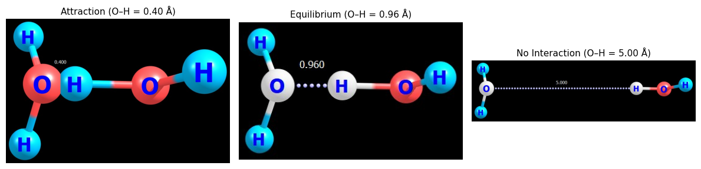
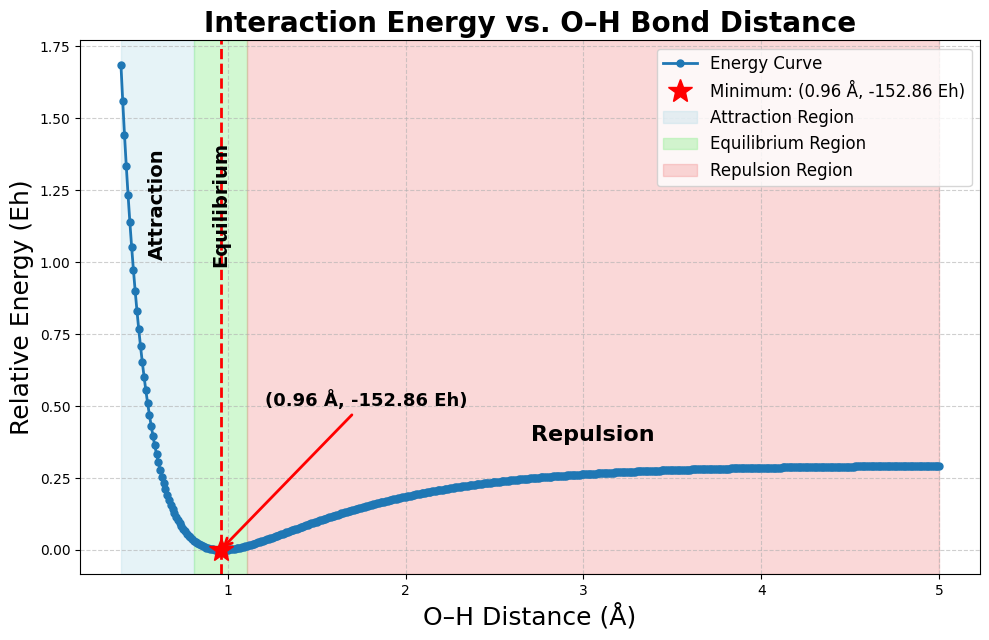

#  Hydrogen Bonding in Water Dimers: Energy Profile

This project analyzes the **hydrogen bond interaction** between two water molecules using **Density Functional Theory (DFT)** in **ORCA**. The interaction energy was computed as a function of the donor H and acceptor O atom distance.

---

##  Methodology

- **System**: H₂O dimer (1 donor, 1 acceptor)
- **Software**: ORCA for quantum calculations, Python (Colab) for analysis
- **Procedure**:
  - Start from an optimized hydrogen-bonded dimer geometry.
  - Fix atomic positions and vary O–H distance from **0.40 Å to 5.00 Å** in 0.01 Å steps.
  - Perform single-point energy calculations for each configuration.
  - Analyze and visualize the interaction energy profile using Python.

---

##  Hydrogen Bond Distance Comparison

This figure illustrates how the O–H interaction changes with distance:



- **Attraction**: O–H = 0.40 Å → Strong repulsion
- **Equilibrium**: O–H = 0.96 Å → Energy minimum
- **No Interaction**: O–H = 5.00 Å → Vanishing interaction

---

##  Energy Profile

The interaction energy curve shows a minimum at **0.96 Å**, where the hydrogen bond is most stable. At shorter distances, repulsion dominates; at longer distances, attractive forces diminish.



Full energy analysis and plotting are implemented in a Jupyter notebook available in the repository.

---

##  Repository Structure

```
 sample_orca_files/         
    ├── H_scan_0.96.inp      
    └── H_scan_0.96.out      

 data_analysis/             
    ├── analysis.ipynb        

 OH_interaction_profile.png 
 hbond_distance_examples.png 
 README.md                  
```

 **Access the Colab notebook directly**: [Ope analysis.ipynb](./OH_interaction_profile_data_analysis.ipynb)

>  **Note**: The full dataset includes 3000+ ORCA `.inp`, `.out`, `.gbw`, and density files for small distance increments (0.01 Å steps). To keep the repository concise, only sample files and summarized results are included. Full data available upon request.

---

Created by [Handson Gisubizo](https://github.com/handsongisubizo)  
Contact: hgisubi1@jhu.edu

