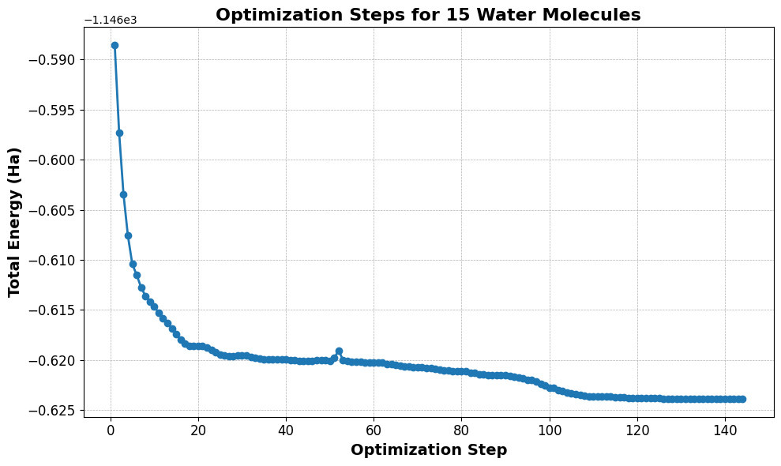
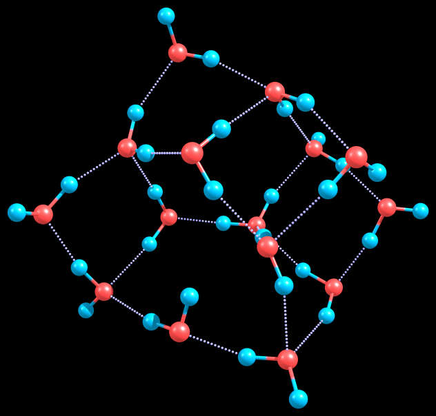
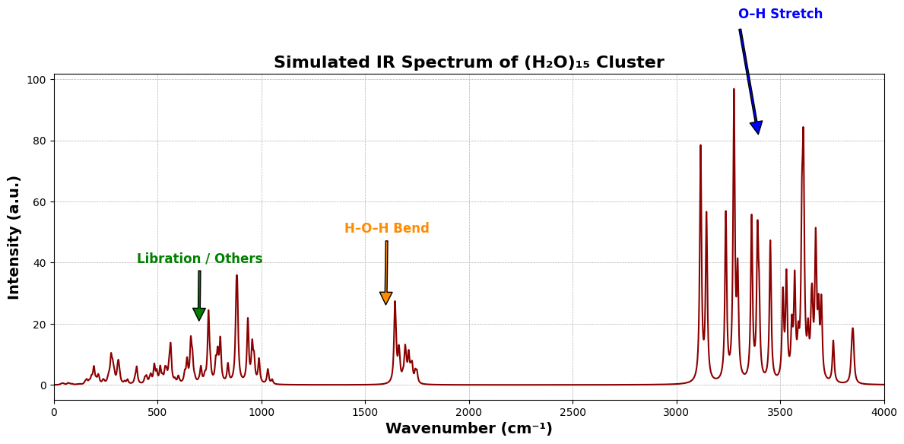
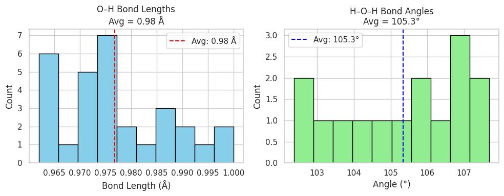

# Water Cluster (H₂O)₁₅: Geometry Optimization and Frequency Analysis

This repository contains **DFT calculations** of a 15-molecule water cluster performed using **ORCA 6.0.0**. The project includes geometry optimization, harmonic vibrational frequency analysis, and visualization of molecular structure and energetics.

 **Watch the full optimization steps here**:  
 [YouTube Video](https://www.youtube.com/watch?v=hJ1o1aLP7s4)

---

##  Files Included

| File                              | Description |
|----------------------------------|-------------|
| `opt_15h2o.inp`                   | ORCA input for geometry optimization |
| `opt_15h2o.out`                   | Output file from optimization |
| `freq_15h2o.inp`                  | ORCA input for frequency analysis |
| `freq_15h2o.out`                  | Frequency analysis output |
| `15h2o_final.xyz`                 | Optimized structure (XYZ format) |
| `opt_energy_15h2o.png`            | Plot of SCF energy vs optimization steps |
| `15h2o_cluster_optimized.jpg`     | Visualization of final water cluster |
| `ir_spectrum_15h2o_annotated.png` | Annotated IR spectrum (key peaks labeled) |
| `bond_stats_15h2o.png`            | Histograms of bond lengths and angles |

---

##  Method Summary

- **Software**: ORCA 6.0.0  
- **Functional**: B3LYP-D4  
- **Basis Set**: def2-TZVP  
- **SCF Settings**: `VeryTightSCF`  
- **Phase**: Gas  
- **Parallelization**: 8 cores, 9000 MB RAM  

---

##  Energy Convergence

Optimization converged smoothly to a minimum, as shown in the SCF energy plot:

---

##  Final Structure

The optimized geometry forms a 3D hydrogen-bonded network:

---

##  IR Spectrum

The simulated IR spectrum reveals expected vibrational features:

- **Libration**: 200–1000 cm⁻¹  
- **H–O–H Bending**: ~1600 cm⁻¹  
- **O–H Stretching**: 3200–3700 cm⁻¹  

---

##  Bond Length & Angle Analysis

| Metric        | Average       | Experimental Range |
|---------------|---------------|---------------------|
| O–H Length    | ~0.98 Å       | 0.97–0.99 Å         |
| H–O–H Angle   | ~105.3°       | 104.5–106°          |

---

##  Highlights

- All vibrational frequencies are real (→ local minimum)  
- Geometry is physically meaningful and chemically sound  
- Bond statistics align well with experimental water cluster data  
- Visualization and analysis performed using Chemcraft + Python  

---

##  Links

-  **Video demonstration**: [DFT Geometry Optimization of (H₂O)₁₅ Cluster](https://www.youtube.com/watch?v=hJ1o1aLP7s4)  
-  **GitHub profile**: [HandsonGisubizo](https://github.com/handsongisubizo)
