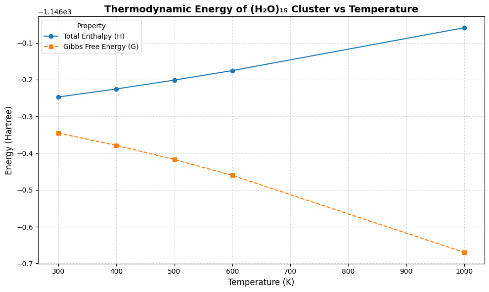
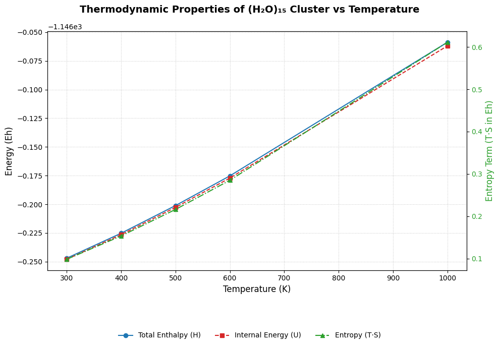

# Thermodynamic Analysis of (H₂O)₁₅ Cluster

This folder contains thermodynamic calculations of a 15-water molecule cluster ((H₂O)₁₅) using ORCA 6.0.0. The simulations were conducted at multiple temperatures to extract thermodynamic properties such as internal energy (U), enthalpy (H), Gibbs free energy (G), and entropy (T·S).

---

## Files Included

| File Name                    | Description |
|-----------------------------|-------------|
| `Opt_15H2O_300.inp` to `Opt_15H2O_1000.inp` | ORCA input files for thermodynamic calculations at different temperatures |
| `Opt_15H2O_300.out` to `Opt_15H2O_1000.out` | ORCA output files containing vibrational and thermodynamic data |
| `thermo_properties_15h2o.png` | Plot showing U, H, and T·S vs. temperature |
| `gibbs_energy_15h2o.png`     | Plot showing Gibbs free energy (G) and enthalpy (H) vs. temperature |
| `README.md`                  | Description of files and methodology used |

---

## Methodology

- **Software**: ORCA 6.0.0
- **Functional**: B3LYP with Grimme D4 dispersion correction
- **Basis Set**: def2-TZVP
- **SCF Settings**: VeryTightSCF
- **Vibrational Calculation**: `Freq` keyword used to obtain thermodynamic functions at each temperature
- **Temperatures Studied**: 300 K to 1000 K

---

## Results

### Thermodynamic Trends

- The total enthalpy (H) and internal energy (U) increase linearly with temperature.
- The entropy contribution (T·S) increases with temperature, as expected.
- The Gibbs free energy (G = H - T·S) decreases with temperature, consistent with the increasing entropy.

### Plots

#### Energy Components

#### Gibbs Free Energy

---

## Summary

This analysis confirms the expected thermodynamic behavior of a water cluster in the gas phase. The temperature dependence of H, U, and G reflects entropic stabilization at higher temperatures. 

---

Created by [Handson Gisubizo](https://github.com/handsongisubizo)  
Contact: hgisubi1@jhu.edu
