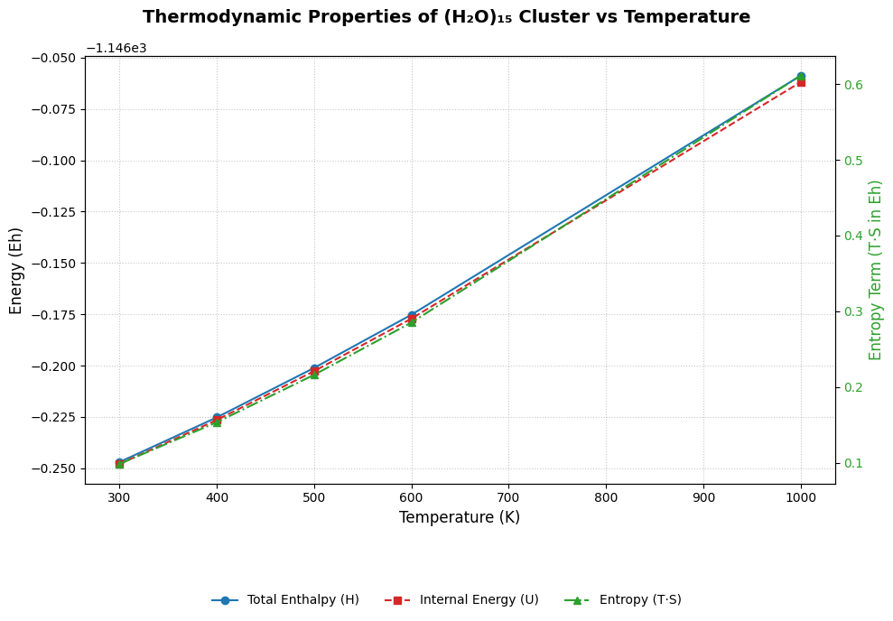
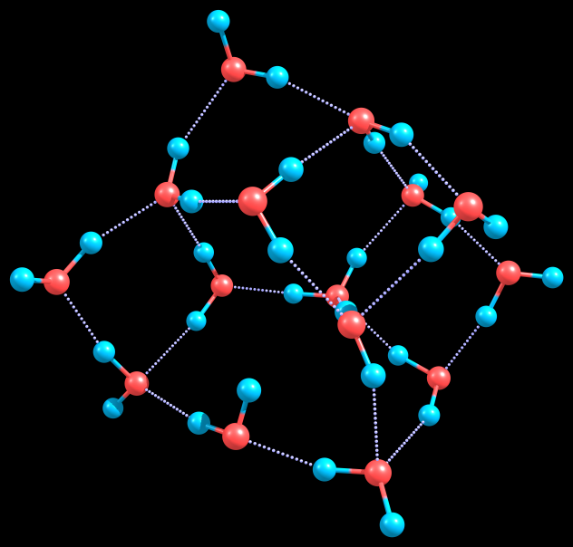
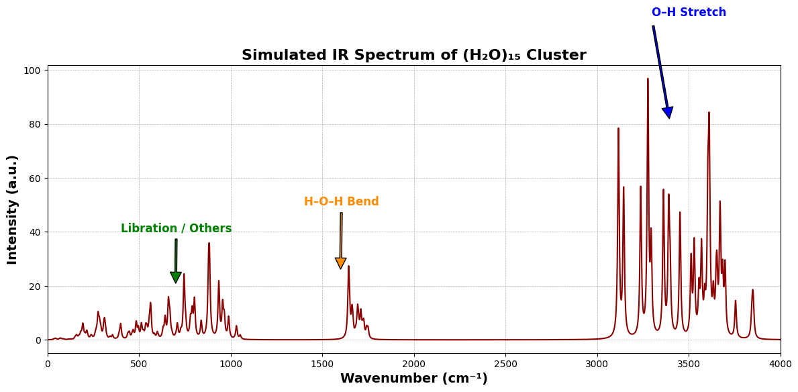
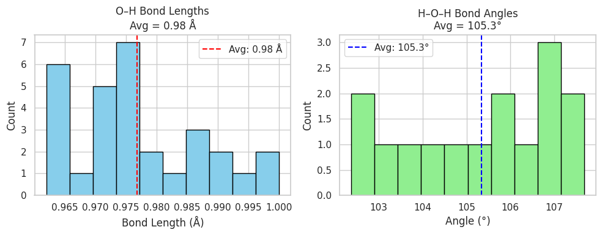

# (H₂O)₁₅ — DFT Geometry Optimization & Vibrational Analysis

DFT study of a 15-molecule water cluster using **ORCA 6.0.0**: geometry optimization, harmonic frequency analysis, and quick visualizations.

[](https://www.youtube.com/watch?v=hJ1o1aLP7s4)

---

## Files

| File | What it is |
|---|---|
| `opt_15h2o.inp` | ORCA input (geometry optimization) |
| `opt_15h2o.out` | ORCA output (optimization) |
| `freq_15h2o.inp` | ORCA input (frequency analysis) |
| `freq_15h2o.out` | ORCA output (frequencies) |
| `15h2o_final.xyz` | Optimized structure (XYZ) |
| `gibbs_energy_15h2o.png` | Energy vs. optimization step |
| `15h2o_cluster_optimized.jpg` | Final cluster snapshot |
| `ir_spectrum_15h2o_annotated.png` | Simulated IR with key peaks |
| `bond_stats_15h2o.png` | O–H and H–O–H distributions |

> **Note:** Large `.out` files may not preview on GitHub. Click **“View raw”** to download.

---

## Methods (Quick)

- **Code:** ORCA 6.0.0  
- **Functional:** B3LYP-D4  
- **Basis:** def2-TZVP  
- **SCF:** `VeryTightSCF`  
- **Phase:** Gas  
- **Parallel:** 8 cores, ~9 GB RAM  

---

## Results

**Convergence:** Optimization reached a minimum; all vibrational frequencies are real.  


**Structure:** Compact 3D H-bond network.  


**IR (simulated):**
- Libration: **200–1000 cm⁻¹**  
- H–O–H bend: **~1600 cm⁻¹**  
- O–H stretch: **3200–3700 cm⁻¹**  


**Bond statistics:**

| Metric | Average | Experimental Range |
|---|---:|---:|
| O–H (Å) | ~0.98 | 0.97–0.99 |
| H–O–H (°) | ~105.3 | 104.5–106 |



---

## Reproduce (optional)

Run locally with ORCA:
```bash
orca opt_15h2o.inp > opt_15h2o.out
orca freq_15h2o.inp > freq_15h2o.out
