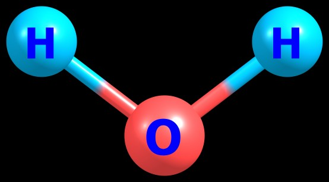
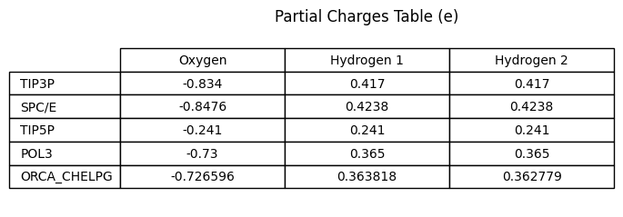
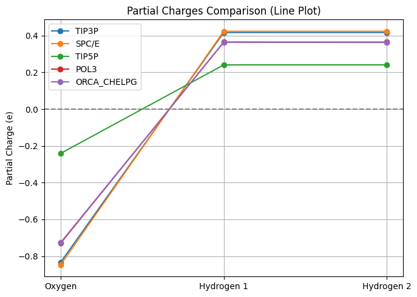

# Partial Atomic Charges of Water from ORCA

This project demonstrates how I used [**ORCA**](https://www.faccts.de/orca/) to compute the [**partial atomic charges**](https://pubs.acs.org/doi/10.1021/acs.jctc.0c01102) of a single water molecule (H₂O) using the [**CHELPG method**](https://en.wikipedia.org/wiki/CHELPG). The results are then compared to several well-known water models commonly used in [molecular dynamics](https://en.wikipedia.org/wiki/Molecular_dynamics) and [force field development](https://en.wikipedia.org/wiki/Force_field_(chemistry)).

---

## Molecular Structure

The water molecule shown below was used as the geometry input to compute CHELPG partial atomic charges using ORCA.

---

## CHELPG vs Standard Water Models

The plot compares CHELPG-derived charges from **ORCA** with established models such as [**TIP3P**](https://pubs.acs.org/doi/10.1021/jp003020w), [**SPC/E**](https://pubs.acs.org/doi/10.1021/jp003020w), **POL3**, and [**TIP5P**](https://docs.lammps.org/Howto_tip5p.html). You can see that the ORCA result closely aligns with [**POL3**](https://pubs.acs.org/doi/10.1021/jp110391q), a DFT-informed force field, and also shows strong agreement with the other classical models — confirming the realism and reliability of the computed charges.

---

The table and plots were implemented in **Google Colab notebook** here: [Open orca-water-partial-charges.ipynb](./orca_water_partial_charges.ipynb)

---

## Method Summary

- **Software**:[ORCA](https://www.faccts.de/orca/)
- **Level of theory**: [B3LYP](https://en.wikipedia.org/wiki/Hybrid_functional#B3LYP) with [`D4`]( dispersion and [`def2-TZVP`] basis set

- **Charge fitting method**: CHELPG (Electrostatic Potential)
- **System**: Water molecule (H₂O)
- **Output**: Partial charges on O, H1, and H2 atoms

---

## Input and Output Files

You can explore or reproduce the ORCA calculation using the files below:

 🔹 [`Partial_charge.inp`](./Partial_charge.inp) – ORCA input file
 
 🔹 [`Partial_charge.out`](./Partial_charge.out) – ORCA output file
 
 🔹 [`Partial_charge.pc_chelpg`](./Partial_charge.pc_chelpg) – CHELPG charges and atomic coordinates

---

## Files in This Repository

| File                                      | Description                                         |
|-------------------------------------------|-----------------------------------------------------|
| `Partial_charge.inp`                      | ORCA input file for a single water molecule         |
| `Partial_charge.out`                      | ORCA output file with CHELPG charge results         |
| `Partial_charge.pc_chelpg`                | Final CHELPG point charges and coordinates          |
| `orca_vs_forcefield_partial_charges.png`  | Plot comparing ORCA charges to classical models     |
| `README.md`                               | This documentation file                             |

---

## This simple analysis shows how quantum-derived charges:

- Are physically meaningful and symmetry-consistent
- Compare well with trusted classical models like **POL3**

---

Created by: Handson Gisubizo
GitHub: https://github.com/handsongisubizo
