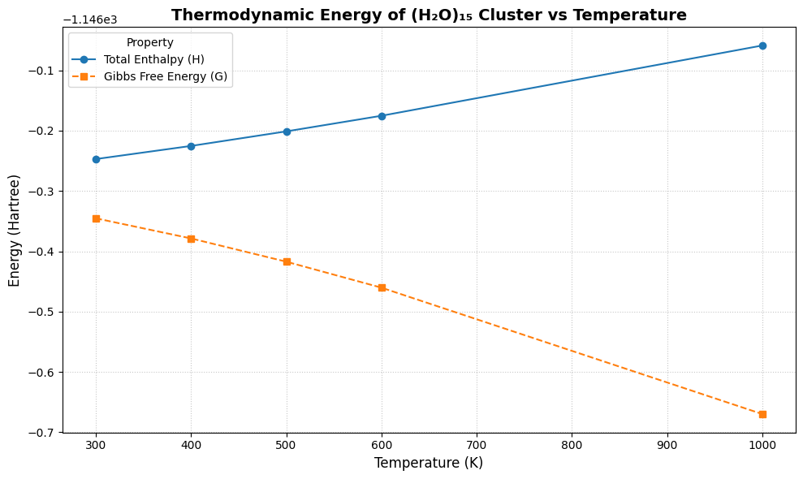

# Thermodynamic Analysis of (H₂O)₁₅ Cluster

This folder contains thermodynamic calculations of a **15-water molecule cluster** `((H₂O)₁₅)` using [**ORCA 6.0.0**](https://orcaforum.kofo.mpg.de/). The simulations were conducted at multiple temperatures to extract key thermodynamic properties:

- [**Internal Energy (U)**](https://en.wikipedia.org/wiki/Internal_energy)
- [**Enthalpy (H)**](https://en.wikipedia.org/wiki/Enthalpy)
- [**Gibbs Free Energy (G)**](https://en.wikipedia.org/wiki/Gibbs_free_energy)
- [**Entropy (T·S)**](https://en.wikipedia.org/wiki/Entropy)

Each property was derived from vibrational frequency and thermochemistry data generated via ORCA.

---

## Files Included

| File Name | Description |
|-----------|-------------|
| [Opt_15H2O_300.inp](./Opt_15H2O_300.inp) to [Opt_15H2O_1000.inp](./Opt_15H2O_1000.inp) | ORCA input files for thermodynamic calculations at different temperatures |
| [Opt_15H2O_300.out](./Opt_15H2O_300.out) to [Opt_15H2O_1000.out](./Opt_15H2O_1000.out) | ORCA output files containing vibrational and thermodynamic data |
| [thermo_properties_15h2o.png](./thermo_properties_15h2o.png) | Plot showing U, H, and T·S vs. temperature |
| [gibbs_energy_15h2o.png](./gibbs_energy_15h2o.png) | Plot showing Gibbs free energy (G) and enthalpy (H) vs. temperature |
| [README.md](./README.md) | Description of files and methodology used |

---

## Results

### Thermodynamic Trends

- The total enthalpy (H) and internal energy (U) increase linearly with temperature.
- The entropy contribution (T·S) increases with temperature, as expected.
- The Gibbs free energy (G = H - T·S) decreases with temperature, consistent with the increasing entropy.

### Plots

#### Energy Components

#### Gibbs Free Energy

---

## Summary

This analysis confirms the expected thermodynamic behavior of a water cluster in the gas phase. The temperature dependence of H, U, and G reflects entropic stabilization at higher temperatures. 

---

Created by [Handson Gisubizo](https://github.com/handsongisubizo)  

