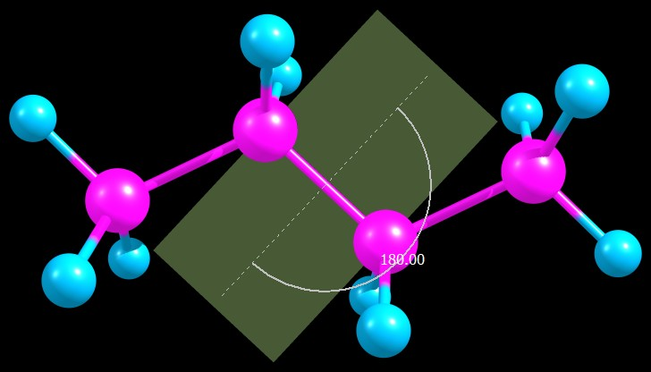
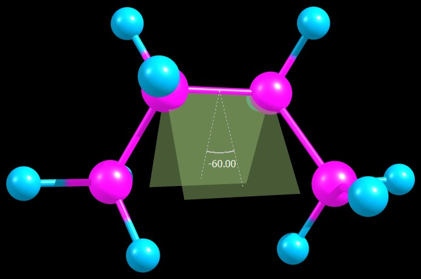
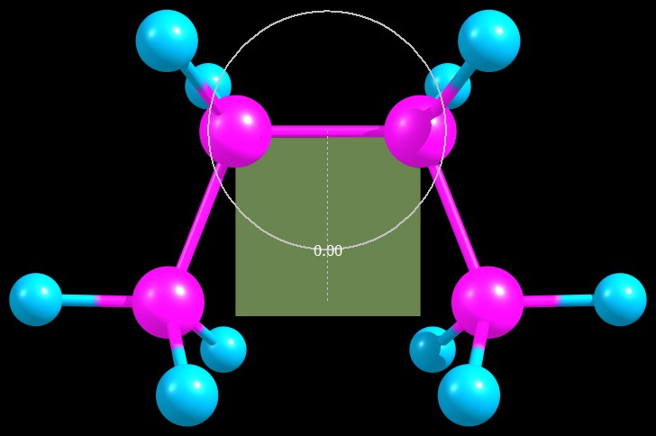
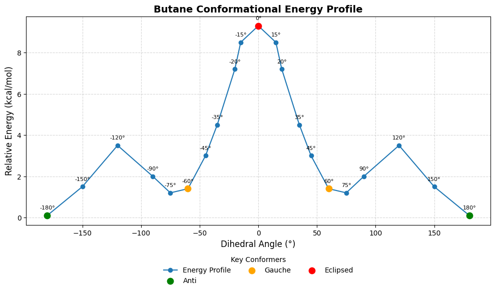

# Butane Conformational Energy Profile

## Purpose of Study

This project investigates how rotation around the central C–C–C–C dihedral angle affects the potential energy of butane. The aim is to visualize and quantify the energy changes as the molecule rotates, identifying stable conformers and rotational barriers.

Understanding conformational energy profiles is fundamental in physical chemistry and molecular modeling, explaining:
- Why certain conformations are more stable.
- How molecules transition between conformers.
- The concept of torsional strain and energy barriers.

---

## Background

Butane is a simple alkane, making it an ideal system to study dihedral rotation effects. Its conformational landscape includes:
- **Anti conformation** (global minimum).
- **Gauche conformations** (local minima).
- **Eclipsed conformations** (energy maxima).

This analysis uses quantum chemical methods to compute the **potential energy surface (PES)** by systematically rotating the dihedral angle and calculating the corresponding single-point energies.

---

## Method Summary

- Molecule construction: Avogadro.
- Dihedral variation: −180° to +180° in 20 steps.
- Energy calculations: Single-point ORCA (dihedral angle fixed).
- Energy analysis: Python scripting.
- Visualization: Matplotlib (energy profile) and Chemcraft (structures).

---

## Key Results

- **Anti conformation (180°):** Global minimum.
- **Gauche conformations (±60°):** Local minima.
- **Eclipsed conformation (0°):** Energy maximum.

Energy differences:
- Anti to Gauche: ~1.28 kcal/mol.
- Anti to Eclipsed: ~7.9 kcal/mol.

These results match well-known experimental and theoretical data, validating the computational approach.

---

## Sample Conformer Structures

**Anti Conformer (180°):**

**Gauche Conformer (60°):**

**Eclipsed Conformer (0°):**

These images illustrate the structural differences between the key conformers.

---

## Energy Profile Plot

The rotational energy profile clearly shows energy minima and maxima as the molecule rotates:

---

## Insights

This project demonstrates:
- How molecular rotation affects stability and energy.
- Visualization of the potential energy surface (PES).
- Use of computational chemistry and Python scripting for molecular analysis.
- The origin of torsional strain and conformational preferences in simple hydrocarbons.

---

##  Links
-  **GitHub profile**: [HandsonGisubizo](https://github.com/handsongisubizo)
