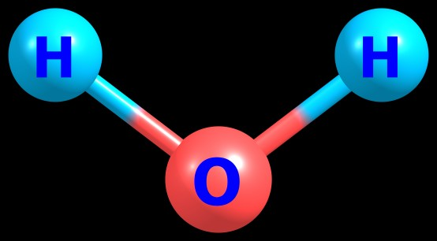
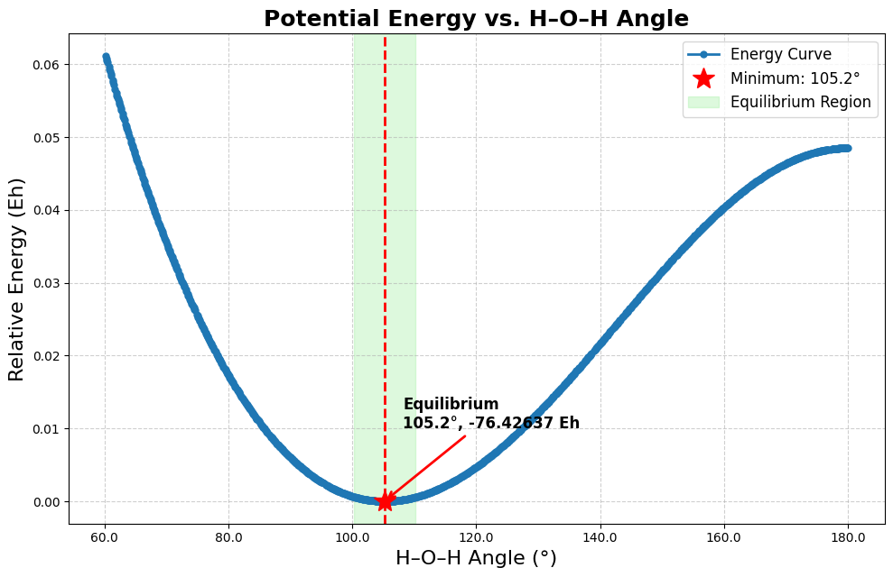
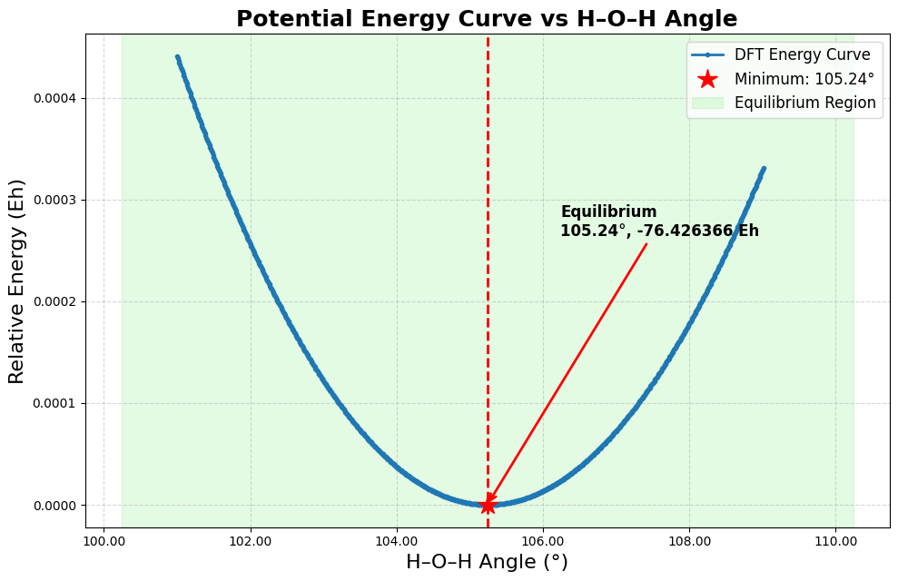
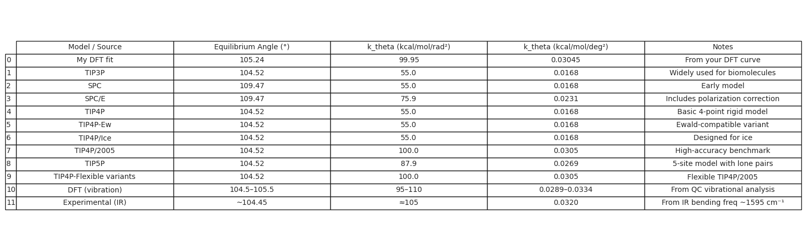
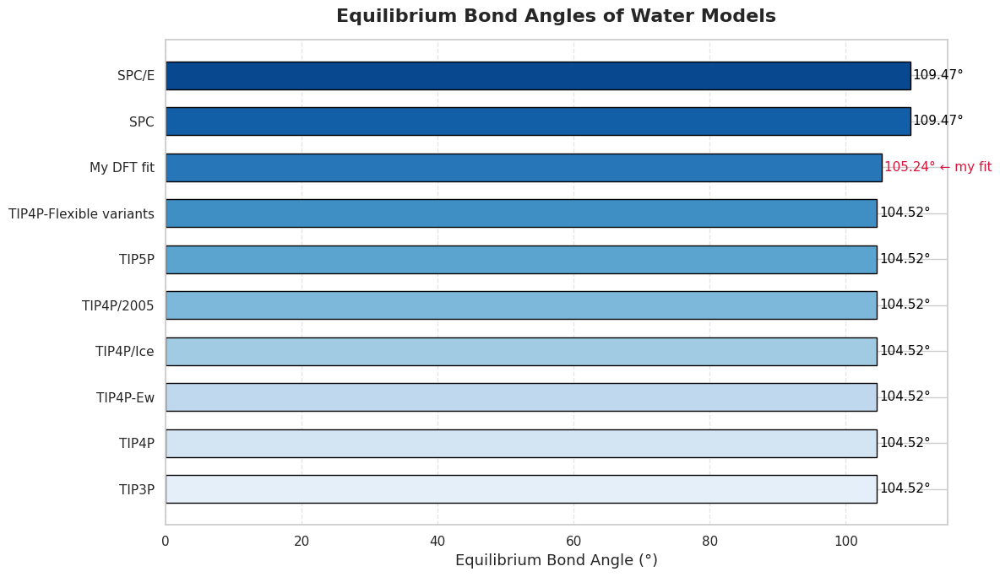
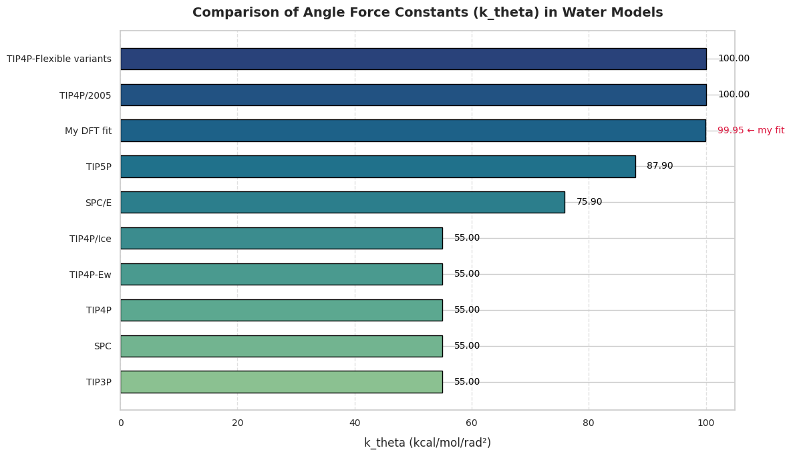

# H–O–H Angle Deformation in Water: Energy Profile

This project investigates how the potential energy of a single water molecule changes with variations in the **H–O–H bond angle**. Using **Density Functional Theory (DFT)** calculations performed in [ORCA](https://www.faccts.de/orca/),[single-point energies](https://atomistica.online/course-what-is-molecular-modeling/part-2-introduction-to-single-point-energy-calculations/) were computed across a range of fixed angles to generate a detailed **energy profile** of angular deformation.

---

## Optimized Structure

The image below shows the geometry of a single water molecule used in this study:

---

## Methodology

- **System**: Single H₂O molecule  
- **Software**: ORCA for quantum chemistry; Python [Google Colab](https://colab.research.google.com) for analysis  
- **Procedure**:
  - Begin from the optimized geometry of H₂O (equilibrium H–O–H angle ≈ 105.2°)
  - Fix O–H bond lengths and vary the **H–O–H bond angle** from 60° to 180° in 0.1° steps
  - Perform **single-point energy calculations** at each angle
  - Visualize and fit the energy curve using Google Colab.
 
---

## Input/Output Files
Over 300 ORCA input/output files were generated by scanning the H–O–H bond angle.

To explore a sample configuration:

🔹 Input:  [angle_water.inp](./H2O_angle_0096p6.inp)  
🔹 Output: [angle_water.out](./H2O_angle_0096p6.out)

---

## H–O–H Angle Energy Profile

This figure illustrates how the energy of a water molecule changes with angle deformation:

**Access or retrieve** the raw input data: [angle_energy_data.csv](./angle_energy_data.csv)

---

**Interaction Behavior**:
- **Repulsion**: Angle = 60° → High energy due to strong steric repulsion  
- **Equilibrium**: Angle ≈ 105.2° → Minimum energy configuration  
- **Deformation**: Angle = 180° → Higher energy due to orbital strain  

---

## Energy Curve Fitting and Force Constant

To quantify the stiffness of **the H–O–H angle** in a water molecule, we performed a parabolic fit around the energy minimum.

**visualize or download** the raw data used: [View notebook: Angle_forceconst.ipynb](./Angle_forceconst.ipynb)
 

## A zoomed-in plot near the energy minimum 

**Plot or export** the source data: [angle_energy_near minimum.csv](./hoh_angle_energy_data_const.csv)

---

#  Angular Force Constant & Bond Angle Analysis

This section uses the above DFT data to calculate the angular force constant \( k_\theta \) of water and compares it with values from widely used water models.

---

##  How Is \( k_\theta \) Calculated?

We apply the harmonic approximation:

\[
\Delta E = \frac{1}{2} k_\theta (\Delta \theta)^2
\]

**Inputs from DFT:**
- Equilibrium angle: \( \theta_0 = 105.24^\circ \)
- Perturbed angle: \( \theta_1 = 104.24^\circ \)
- Energies:  
  \( E_0 = -76.42636593 \),  
  \( E_1 = -76.42634167 \) Hartree

**Steps:**

1. **Energy difference**  
   \( \Delta E = E_1 - E_0 = 0.00002426 \) Hartree  
2. **Angle change**  
   \( \Delta \theta = -1.00^\circ = -0.01745 \) rad  
3. **Force constant**  
   \[
   k_\theta = \frac{2 \Delta E}{(\Delta \theta)^2} = 0.15928 \, \text{Hartree/rad}^2
   \]
4. **Conversions**  
   - \( 0.15928 \times 627.5095 = 99.95 \, \text{kcal/mol/rad}^2 \)  
   - \( 99.95 / 3282.81 = 0.03045 \, \text{kcal/mol/deg}^2 \)

---

##  Comparison Plots

You can explore the interactive **Google Colab notebook** used for all calculations, visualizations, and analysis:  
 [View notebook: Water models k_theha and Angle analysis](./water_models_k_theta_angle_analysis.ipynb)

---

### Force Constant Table

 A tabulated overview of models, angles, and angular force constants.

---

###  Bond Angle Comparison

 Visual comparison of **equilibrium H–O–H bond angles** for popular water models.

---

###  Angular Force Constant Comparison

Bar plot comparing the **stiffness of angle bending** \( k_\theta \) across models.

---

## Conclusion

The DFT-derived angular force constant and bond angle for water:

- \( k_\theta = 99.95 \, \text{kcal/mol/rad}^2 \)
- \( \theta_0 = 105.24^\circ \)

show **excellent agreement** with the most accurate flexible water models such as:

- **TIP4P/2005** and **TIP4P-Flexible variants**, both having \( k_\theta \approx 100 \, \text{kcal/mol/rad}^2 \)
- Your bond angle is slightly closer to experimental vibrational values than the common fixed angle of 104.52° used in TIP models.

This confirms the quality of your DFT results and validating methods used.

## Author

Created by: **Handson Gisubizo**  
 GitHub: [https://github.com/handsongisubizo](https://github.com/handsongisubizo)
