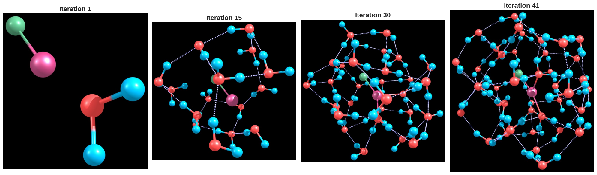
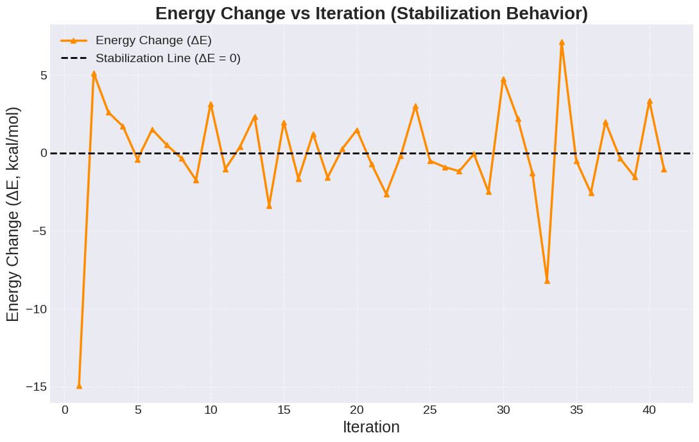

## Solvation of NaCl with Water Molecules (ORCA + xTB + ALPB)

A **hybrid solvation** approach was used to study the progressive hydration of a neutral **NaCl ion pair**. The system was solvated with **1–41 explicitly placed water molecules**, and each configuration was **geometry‑optimized**. To capture long‑range bulk effects, the **ALPB (Analytical Linearized Poisson–Boltzmann)** implicit solvent model for water was applied **alongside the explicit molecules**. Calculations were performed in **ORCA** using the **xTB (GFN2‑xTB)** semiempirical Hamiltonian, which balances computational efficiency and accuracy for larger molecular systems. The number of explicit solvent molecules was controlled via the **%solvator** block in ORCA. Post‑processing and visualization were done in **Python** (Google Colab).

## Methodology

- **System sizes:** NaCl solvated by *n* water molecules, with *n* = 1…41.  
- **Level of theory:** xTB (GFN2‑xTB) in ORCA; implicit solvent **ALPB (water)**.  
- **Optimization:** Full geometry optimization for each *n*.  
- **Incremental stabilization metric**

  $$\Delta E_n = E(\mathrm{NaCl}\cdot n\,\mathrm{H_2O}) - E(\mathrm{NaCl}\cdot (n-1)\,\mathrm{H_2O}) - E(\mathrm{H_2O})$$

  Negative $\Delta E_n$ means the added water further stabilizes the complex.

- **Analysis:** Extract $\Delta E_n$ and plot it vs. $n$ to reveal stabilization trends and hydration-shell completion.


## Results — Stabilization Behavior During NaCl Solvation

> 




The incremental interaction energy **(\(\Delta E\))** was monitored as water molecules were sequentially added to the NaCl ion pair. The profile shows an **overall trend toward stabilization**, with the **largest energy drop** occurring after the **second water molecule**, suggesting strong initial ion–solvent interactions. As additional water molecules are added, the **energy changes fluctuate around zero**, indicating **reduced incremental stabilization** and the **progressive saturation of the first hydration shell**.

> *Figure.* Incremental stabilization energy, $\Delta E_n$ (kcal·mol$^{-1}$), per added water molecule during NaCl hydration. The dashed line at $\Delta E_n = 0$ marks the no-stabilization baseline. *(Replace the placeholder below with your plot path.)*
> 


## Conclusion

- The NaCl ion pair stabilizes rapidly with the **first few waters**, dominated by strong ion–dipole interactions.  
- Beyond the initial additions, **\(\Delta E\)** fluctuates near zero, consistent with **hydration‑shell completion** and the onset of **bulk‑like behavior**.  
- This **hybrid explicit–implicit** protocol (xTB + ALPB in ORCA) provides a **computationally efficient** pathway to map solvation growth while retaining key physical trends.

## Reproducibility Notes

- **Code/Environment:** ORCA for electronic structure; Python (Google Colab) for parsing and plotting.  
- **Suggested repo layout:**
  ```text
  nacl_solvation/
  ├─ data/                      # ORCA outputs by n (1…41)
  ├─ scripts/                   # parsing + plotting notebooks
  ├─ figs/
  │  └─ nacl_solvation_stabilization.png
  └─ README.md
  ```
