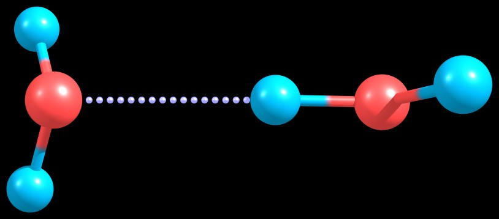
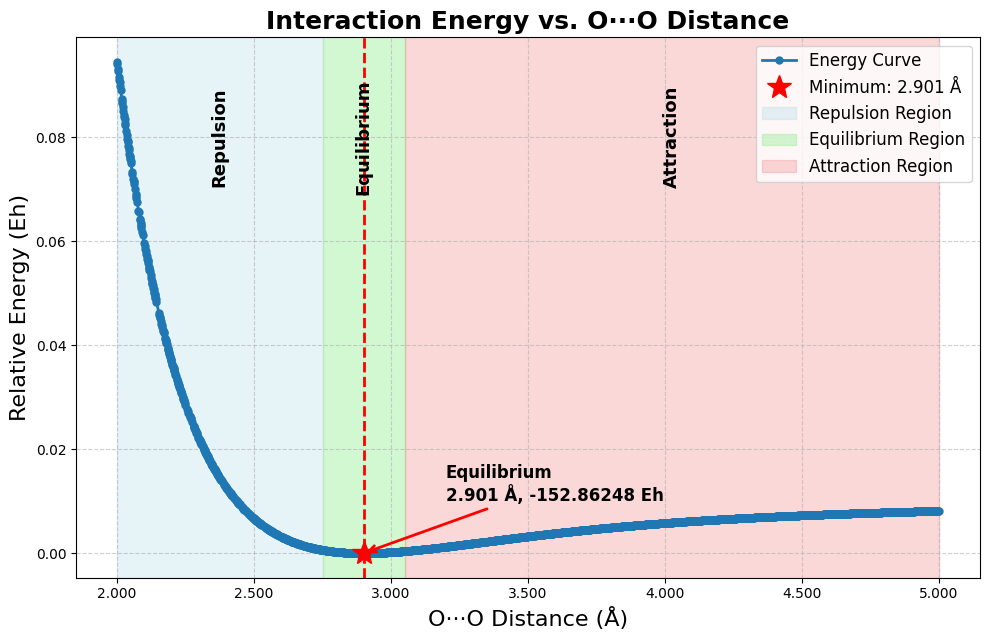

# O···O Interaction in Water Dimers: Energy Profile

This project analyzes the **non-bonded O···O interaction** between two water molecules using **Density Functional Theory (DFT)** in **ORCA**. The interaction energy was computed as a function of the distance between the **oxygen atoms** of the donor and acceptor water molecules.

## Optimized Structure

The image below shows the optimized water dimer used in this study:

---

## Methodology

- **System**: H₂O dimer (1 donor, 1 acceptor)
- **Software**: ORCA for quantum calculations, Python (Colab) for analysis
- **Procedure**:
  - Start from an optimized hydrogen-bonded water dimer geometry.
  - Fix atomic positions and vary the **O···O distance** from 2.00 Å to 5.00 Å in 0.01 Å steps.
  - Perform single-point energy calculations for each configuration.
  - Analyze and visualize the interaction energy profile using Python.

---

## O···O Interaction Distance Profile

This figure illustrates how the non-bonded O···O interaction between two water molecules changes with distance:

---

**Interaction Behavior**:
- **Repulsion**: O···O = 2.00 Å → Strong electronic repulsion due to orbital overlap  
- **Equilibrium**: O···O = 2.901 Å → Minimum energy point (−152.86248 Eh)  
- **No Interaction**: O···O ≥ 5.00 Å → Long-range distance, interaction vanishes

If you'd like to **visualize or download** the data used in this analysis, get the CSV file here: [o_o_energy_data.csv](./o_o_energy_data.csv).

---

## Energy Profile

The interaction energy curve shows a minimum at 2.901 Å, which corresponds to the most stable O···O distance in the hydrogen-bonded water dimer.
- At shorter distances, strong repulsion arises due to electron cloud overlap.
- At longer distances, the attractive interaction fades.

Full analysis and plots are implemented in a Jupyter notebook (`oo_energy_analysis.ipynb`).

**Google Colab notebook**: [Open oo_energy_analysis.ipynb](./oo_energy_analysis.ipynb)

---

Created by: Handson Gisubizo
GitHub: https://github.com/handsongisubizo

