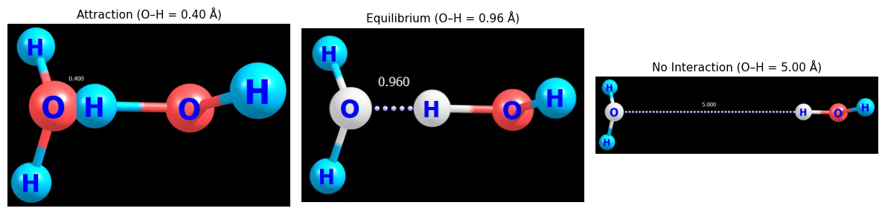
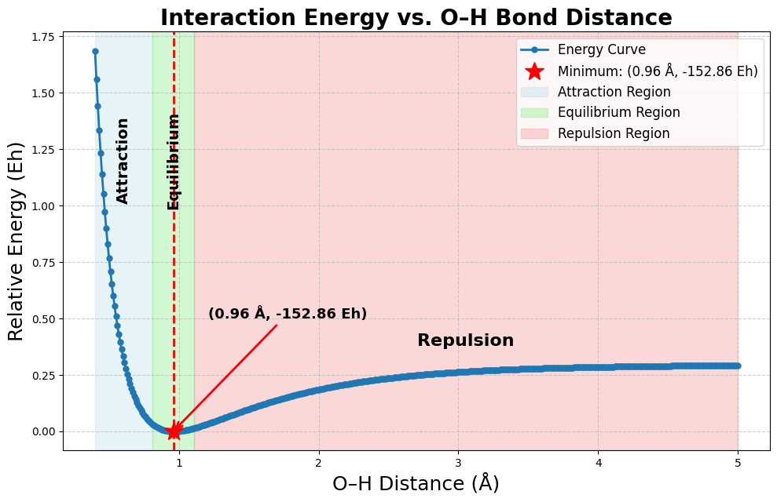

#  Hydrogen Bonding in Water Dimers: Energy Profile

This project analyzes the **hydrogen bond interaction** between two water molecules using **Density Functional Theory (DFT)** in **ORCA**. The interaction energy was computed as a function of the donor H and acceptor O atom distance.

---

##  Methodology

- **System**: H₂O dimer (1 donor, 1 acceptor)
- **Software**: ORCA for quantum calculations, Python (Colab) for analysis
- **Procedure**:
  - Start from an optimized hydrogen-bonded dimer geometry.
  - Fix atomic positions and vary O–H distance from **0.40 Å to 5.00 Å** in 0.01 Å steps.
  - Perform single-point energy calculations for each configuration.
  - Analyze and visualize the interaction energy profile using Python.

---

##  Hydrogen Bond Distance Comparison

This figure illustrates how the O–H interaction changes with distance:



- **Attraction**: O–H = 0.40 Å → Strong repulsion
- **Equilibrium**: O–H = 0.96 Å → Energy minimum
- **No Interaction**: O–H = 5.00 Å → Vanishing interaction

---

##  Energy Profile

The interaction energy curve shows a minimum at **0.96 Å**, where the hydrogen bond is most stable. At shorter distances, repulsion dominates; at longer distances, attractive forces diminish.



Full energy analysis and plotting are implemented in a Jupyter notebook available in the repository.

---

## 🔩 O–H Bond Force Constant Analysis

To assess the stiffness of the O–H bond, a harmonic analysis was performed using a single, gas-phase water molecule. The O–H bond was stretched and compressed symmetrically in 0.01 Å increments around the equilibrium geometry, with all other atoms fixed. For each geometry, DFT single-point energy calculations were conducted using ORCA.

Near the equilibrium distance, the potential energy curve follows a harmonic form:

$$
E = \frac{1}{2}k(x - x_0)^2
$$

Fitting this curve yielded an equilibrium bond length \( x_0 = 0.966 \) Å and a force constant of **740.8 N/m**.


The extracted force constant was compared against experimental spectroscopy and widely used empirical water models including TIP3P, SPC/E, and TIP4P. DFT produced the highest stiffness value, as expected from its quantum-level description.


This comparison highlights how empirical models trade physical accuracy for computational simplicity. While DFT reflects quantum-level precision, classical models remain useful for large-scale simulations.

---


##  Repository Structure

```
 sample_orca_files/         
    ├── H_scan_0.96.inp      
    └── H_scan_0.96.out      

 data_analysis/             
    ├── analysis.ipynb        

 OH_interaction_profile.png 
 hbond_distance.png 
 README.md                  
```

 **Access the Colab notebook directly**: [Open analysis.ipynb](./OH_interaction_profile_data_analysis.ipynb)

>  **Note**: The full dataset includes 3000+ ORCA `.inp`, `.out`, `.gbw`, and density files for small distance increments (0.01 Å steps). To keep the repository concise, only sample files and summarized results are included. Full data available upon request.

---

Created by [Handson Gisubizo](https://github.com/handsongisubizo)  
